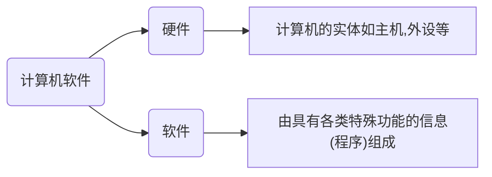
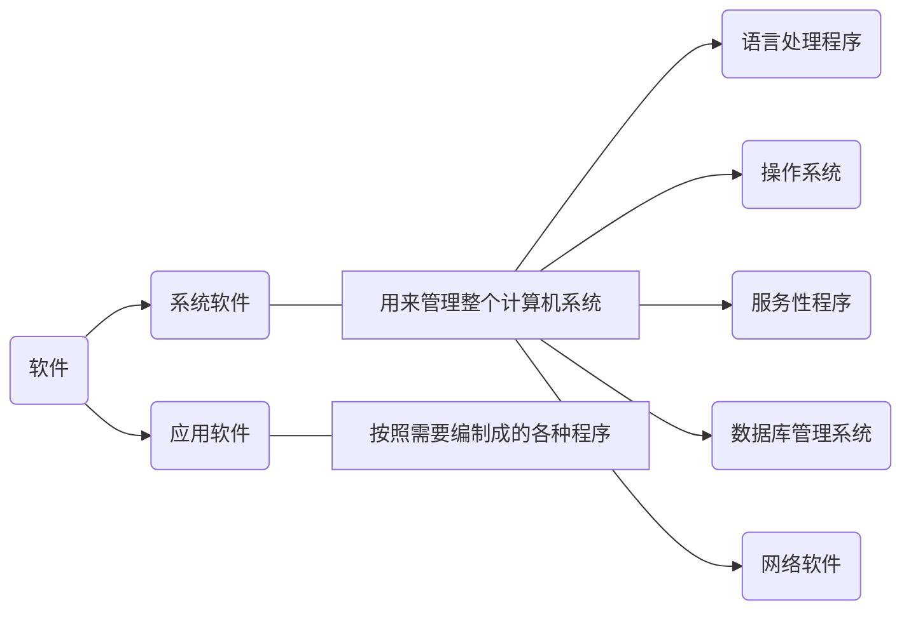
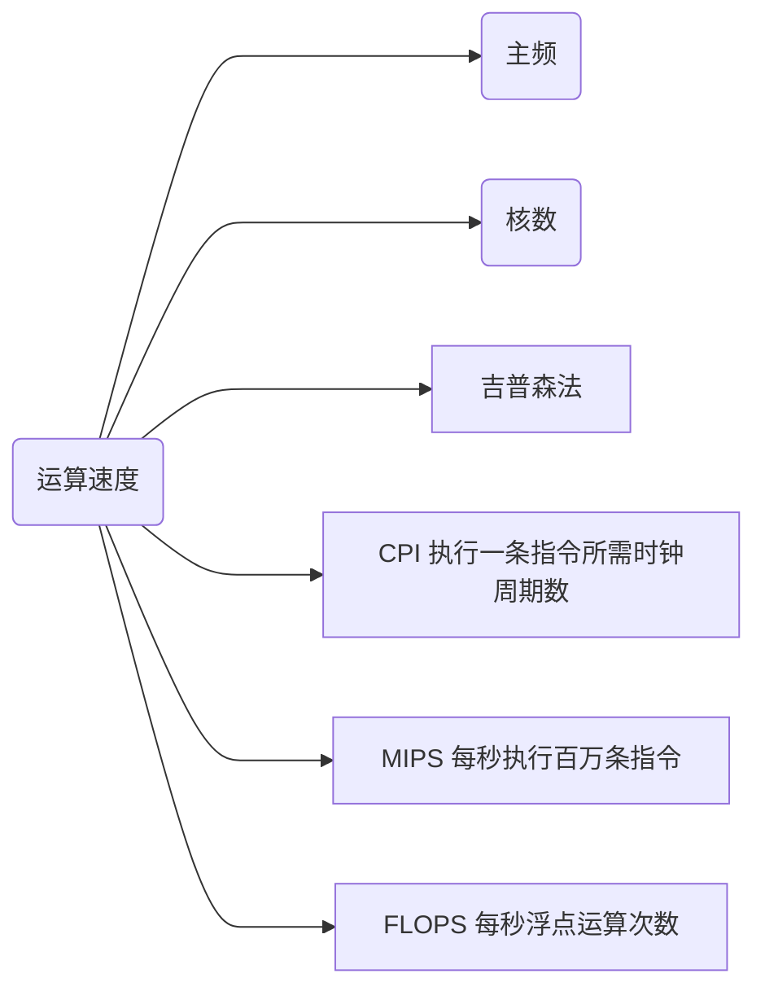
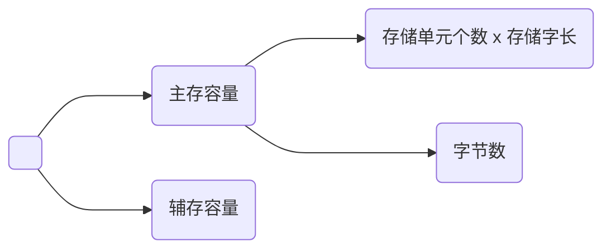

# 第一章计算机的基本组成

## 1.1 计算机系统简介

### 一、计算机的软硬件概念

### 二、计算机的层次结构

-   系统复杂性管理的方法 - 1
    -   ✔ 抽象: 隐藏系统中不重要的细节

### 三、计算机体系结构和计算机组成

计算机体系结构: 程序员所见到的计算机系统的属性概念性的结构与功能特性

计算机组成: 实现计算机体系结构所体现的属性

## 1.2计算机的基本组成
### 一、 冯·诺依曼计算机的缺点

1. 计算机由五大部分组成
2. 指令和数据以同等地位存于存储器,可以按照地址寻访
3. 指令和数据用二进制表示
4. 指令由操作码和地址码组成
5. 存储程序
6. 以运算器为中心
#### 冯·诺依曼硬件框图
![[冯·诺依曼硬件框图.png]]
![[Pasted image 20230716214123.png]]
### 二、计算机硬件框图
1. 以存储器为中心的计算机硬件框图
![[以存储器为中心的计算机硬件框图.png]]
2. 现代计算机硬件框图

![[现代计算机层次结构图.png]]
- 系统复杂性管理的方法 - 2
	- 层次性 : 将被设计的系统划分为多个模块或子模块
	- 模块化 : 有明确定义的功能和接口
	- 规则性 : 模块更容易被重用
#### 存储器的基本组成

存储单元 : 存放一串二进制代码
存储字 : 存储单元中二进制代码的组合
存储字长 : 存储单元中二进制代码的位数, 每个存储单元赋予一个地址
MAR(存储器地址寄存器) : 反映存储单元的个数
MDR(存储器数据寄存器) : 反映存储字长
#### 运算器的基本组成及操作过程
![[运算器的基本组成.png]]
## 1.3 计算机硬件的主要技术指标
1. 机器字长    CPU一次能处理数据的位数, 与CPU中的寄存器位数有关
2. 
吉普森法:  $T_{\mathrm{M}}=\sum_{i=1}^n f_i t_i$

3. 存储容量

# 第二章计算机的发展及应用
## 2.1 计算机的发展史
- 第一台电子计算机是什么时候出现的？
	- 1946年 美国 ENIAC
- 第一台电子计算机的基本指标？
	- 18000 多个电子管
	- 1500 多个继电器
	- 150 千瓦
	- 30 吨
	- 1500 平方英尺
	- 5000 次加法/秒
- 出现的驱动力是什么，发展的驱动力是什么？
	- 需求,需求,还是需求
	- 技术发展
		- 电子技术的发展
		- 计算机体系结构技术的发展
		- 硬件技术的发展
			 | 代  | 时间        | 硬件技术         | 速度(次/秒) |
			 |:--- |:----------- |:---------------- |:----------- |
			 | 一  | 1946 - 1957 | 电子管           | 40000       |
			 | 二  | 1958 - 1964 | 晶体管           | 200000      |
			 | 三  | 1965 - 1971 | 中小规模集成电路 | 1000000     |
			 | 四  | 1972 - 1977 | 大规模集成电路   | 10000000    |
			 | 五  | 1978 - 现在 | 超大规模集成电路 | 100000000   |
		- 
- 主要部件的发展情况？
- 主要部件的发展规律是什么？
- 主要代表机型？
	- IAS
	- IBM System / 360
- 微型计算机的发展？
	- 微处理器芯片 1971年
	- 存储器芯片 1970年
- 软件的发展？
	- 开发周期长
	- 制作成本昂贵
	- 检测软件产品质量的特殊性
## 2.2 计算机的应用
1. 科学计算和数据处理
2. 工业控制和实时控制
3. 网络技术
	1. 电子商务
	2. 网络教育
	3. 敏捷制造
4. 虚拟现实
5. 办公自动化和管理信息系统
6. CAD/CAM/CIMS
7. 多媒体技术
8. 人工智能
## 2.3计算机的展望
1. 计算机具有类似人脑的一些超级智能功能
2. 芯片集成度的提高受到三方面的限制
	1. 芯片集成度受物理极限的制约
	2. 按照几何级数递增的制作成本
	3. 芯片的功耗、散热、线延迟
3. ? 替代传统的硅芯片
	1. 光计算机
		1. 利用光子取代电子进行运算和存储
	2. DNA生物计算机
		1. 通过控制DNA分子间的生化反应
	3. 量子计算机
		1. 利用原子所具有的量子特征
# 第三章 系统总线
