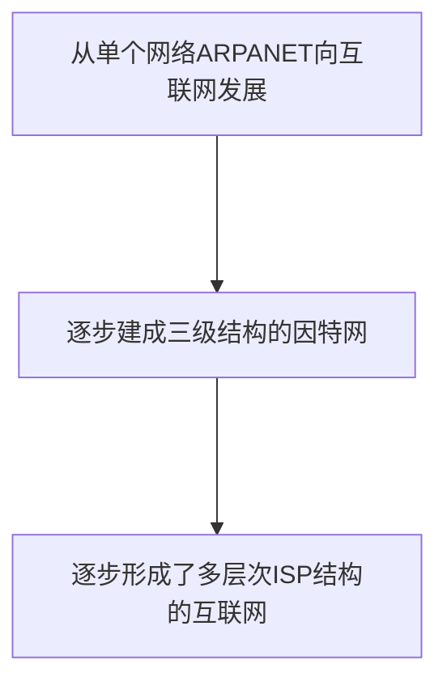

# 第一章 概述
## 计算机网络在信息时代的作用
计算机网络已由一种通信基础设施发展成为一种重要的信息服务基础设施
## 1. 网络、互连网(互联网)和因特网
- 网络由若干结点(Node) 和连接这些结点的链路组成
- 多个网络还可以通过路由器互连起来,这样就构成了一个覆盖范围更大的网络,即互联网. 因此, 互联网是"网络的网络"
- 因特网是世界上最大的互连网络
## 2. 因特网发展的三个阶段

