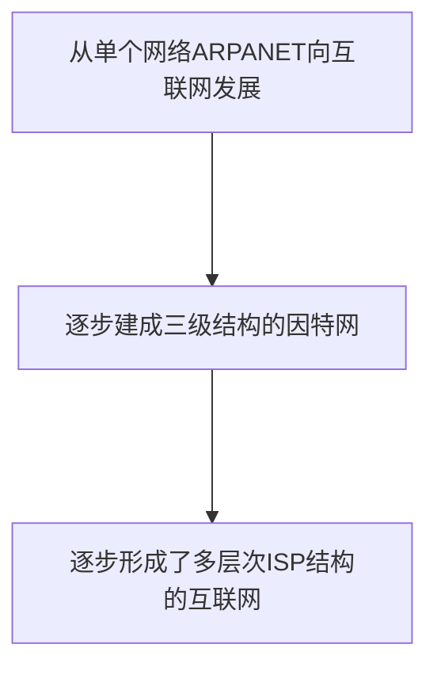
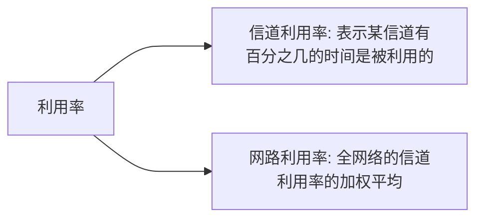
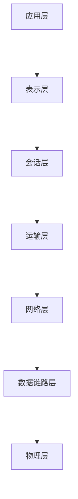
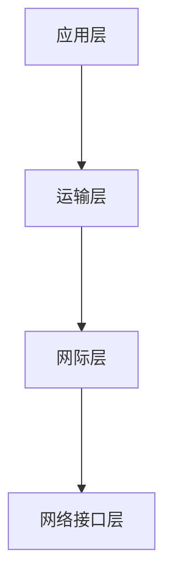

# 第一章 概述
## 1.1计算机网络在信息时代的作用
计算机网络已由一种通信基础设施发展成为一种重要的信息服务基础设施
## 1.2因特网概述
### 1. 网络、互连网(互联网)和因特网
- 网络由若干结点(Node) 和连接这些结点的链路组成
- 多个网络还可以通过路由器互连起来,这样就构成了一个覆盖范围更大的网络,即互联网. 因此, 互联网是"网络的网络"
- 因特网是世界上最大的互连网络
### 2. 因特网发展的三个阶段

### 3. 因特网的标准化工作
- 因特网的标准化工作对因特网的发展起到了非常重要的作用
- 因特网在制定其标准上的一个很大的特点是面向公众
- 因特网协会ISOC是一个国际性组织,负责对因特网进行全面管理,以及在全世界范围内促进其发展和使用
### 4.因特网的组成
- 边缘部分
	- 由所有连接在因特网上的主机组成. 这部分是由用户直接使用, 用来进行通信和资源共享
- 核心部分
	- 由大量网络和连接这些网络的路由器组成.这部分是为边缘部分提供服务的
## 1.3三种交换方式
### 电路交换(Circuit Switching)
- 电话交换机接通电话线的方式称为电路交换
- 从通信资源的分配角度来看,交换是按照某种方式动态的分配传输线路的资源
- 电路交换的三个步骤:
	1. 建立连接(分配通信资源)
	2. 通话(一直占用通信资源)
	3. 释放连接(归还通信资源)
优点: 
1. 通信时延小
2. 有序传输
3. 没用冲突
4. 适用范围广
5. 实时性强
6. 控制简单
缺点: 
1. 建立连接时间长
2. 线路独占,使用效率低
3. 灵活性差
4. 难以规格化
### 分组交换(Packet Switching)
- 发送方: 构造分组, 发送分组
- 路由器: 缓存分组, 转发分组
- 接收方: 接受分组, 还原报文
优点:
1. 无需建立连接
2. 线路利用率高
3. 简化了存储管理
4. 加速传输
5. 减少出错概率和重发数据量
缺点:
1. 引起了转发时延
2. 需要传输额外的信息量
3. 对于数据报服务,存在失序,丢失或者重复分组的问题;对于虚电路服务,存在呼叫建立,数据传输和虚电路释放三个过程
### 报文交换
优点:
1. 无需建立连接
2. 动态分配线路
3. 提高线路可靠性
4. 提高线路利用率
5. 提供多目标服务
缺点:
1. 引起了转发时延
2. 需要较大存储缓存空间
3. 需要传输额外的信息量
### 电路交换、报文交换、分组交换的对比
![[电路交换,报文交换,分组交换的对比.png]]
## 1.4计算机网络的定义和分类
### 计算机网络的定义
- 计算机网络的精确定义并未统一
- 计算机网络的最简单的定义是: 一些互相连接的,自治的计算机的集合
	- 互连: 是指计算机之间可以通过有线或无线的方式进行数据通信
	- 自治 : 是指独立的计算机, 它有自己的硬件和软件,可以单独运行使用
	- 集合: 是指至少需要两台计算机
### 计算机网络的分类
#### 按照交换技术分类
- 电路交换网络
- 报文交换网络
- 分组交换网络
#### 按照使用者分类
- 公用网
- 专用网
#### 按照传输介质分类
- 有线网络
- 无线网络
#### 按照覆盖范围分类
- 广域网 WAN
- 城域网 MAN
- 局域网 LAN
- 个域网 PAN
#### 按照拓扑结构分类
- 总线型网络
- 星型网络
- 环形网络
- 网状型网络
## 1.5计算机网络的性能指标
- 性能指标可以从不同的方面来度量计算机网络的性能
- 常用的指标有以下8个
	- 速率
	- 带宽
	- 吞吐量
	- 时延
	- 时延带宽积
	- 往返时间
	- 利用率
	- 丢包率
### 速率
![[速率与比特.png]]
### 带宽
![[带宽.png]]
### 吞吐量
- 表示在单位时间内通过某个网络的数据量
- 吞吐量经常用于对现实世界的网络的一种测量
- 吞吐量受网络的带宽或额定速率的限制
### 时延
![[时延.png]]
![[时延计算方法.png]]
### 时延带宽积
![[时延带宽积.png]]
### 往返时间
- 因特网上的信息不仅仅单方向传输,而是双向交互
### 利用率

- 当某信道的利用率增大时, 该信道引起的时延也会迅速增加
- 信道利用率并非越高约好
- 如果令$D_0$表示网络空闲时的时延,$D$表示网络当前的时延,那么在适当的假定条件下,可以用简单的公式来表示$D,D_0和利用率U$之间的关系:$D = \frac{D_0}{1 - U}$
	- 当网络利用率达到$50\%$ ,时延就要加倍
	- 当网络利用率达到$50\%$,时延急剧增大
	- 当网络利用率达到$100\%$,时延就趋于无穷大
	- 因此,一些拥有较大主干网的ISP通常会控制它们的信道利用率不超过$50\%$.如果超过了,就要准备扩容,增大线路的带宽
### 丢包率
- 丢包率即分组丢失率，是指在一定的时间范围内，传输过程中丢失的分组数量与总分组数量的比率。
- 丢包率具体可分为接口丢包率、结点丢包率、链路丢包率、路径丢包率、网络丢包率等。
- 丢包率是网络运维人员非常关心的一个网络性能指标，但对于普通用户来说往往并不关心这个指标，因为他们通常意识不到网络丢包。
- 分组丢失主要有两种情况：
	- 分组在传输过程中出现误码，被结点丢弃；
	- 分组到达一台队列已满的分组交换机时被丢弃：在通信量较大时就可能造成网络拥塞。
- 丢包率反映了网络的拥塞情况:
	- 无拥塞时路径丢包率为$0$
	- 轻度拥塞时路径丢包率为$1\% \sim 5\%$
	- 严重拥塞时路径丢包率为$5\% \sim 15\%$
## 1.6计算机网络体系结构
### 常见的计算机网络体系结构
#### OSI体系结构 (法律上的国际标准)

#### TCP/IP体系结构(事实上的国际标准)

![[网络协议图.png]]
### 计算机网络系统结构分层的必要性
- 计算机网络是个非常复杂的系统. 早在最初的ARPANET设计时就提出了分层的设计理念
- "分层"可将庞大而复杂的问题,转化为若干较小的局部问题,而这些较小的局部问题就比较易于研究和处理
![[分层的作用.png]]
### 计算机网络体系结构分层思想举例

### 计算机网络体系结构中的专用术语
- 实体: 任何可发送或接收信息的硬件或软件进程
- 对等实体: 收发双方相同层次中的实体
- 协议: 控制两个对等实体进行逻辑通信的规则的集合
- 协议的三要素: 语法, 语义, 同步
- 协议数据单元: 对等层次之间传送的数据包称为该层的协议数据单元
- 服务数据单元: 同一系统内, 层与层之间交换的数据包称为服务数据单元
![[专用术语.png]]

## 总结
- 第一章 概述
    
    - 1.1 计算机网络在信息时代的作用
        
        - 信息服务基础设施
            
        - 我国互联网发展状况
            
    - 1.2 因特网概述
        
        - 网络, 互联网, 因特网的基本概念
            
        - 互联网发展的三个阶段
            
        - 因特网的标准化工作
            
    - 1.3 三种交换方式
        
        - 电路交换
            
        - 分组交换
            
        - 报文交换
            
    - 1.4 计算机网络的定义和分类
        
        - 定义
            
            - 没用精确统一的定义
                
            - 最简单的定义: 互连, 自治, 计算机集合
                
            - 不同阶段定义不同,反映当时的网络技术发展水平
                
        - 分类
            
            - 按照交换技术
                
            - 按照使用者
                
            - 按照传输介质
                
            - 按照覆盖范围
                
            - 按照拓扑结构
                
    - 1.5 计算机网络的性能指标
        
        - 速率
            
            - 比特
                
            - 速率
                
        - 带宽
            
            - 模拟信号系统
                
            - 计算机网络
                
        - 吞吐量
            
        - 时延
            
            - 发送时延
                
            - 传播时延
                
            - 处理时延
                
        - 时延带宽积
            
        - 往返时间
            
        - 利用率
            
        - 丢包率
            
    - 1.6 计算机网络的体系结构
        
        - 常见的计算机网络体系结构
            
            - OSI七层体系结构
                
            - TCP/IP的四层体系结构
                
            - 五层协议的原理体系结构
                
        - 分层的必要性
            
            - 计算机网络是个非常复杂的系统
                
            - 分层可以将庞大而复杂的问题,转化为若干较小的局部问题
                
            - 以五层结构为例,说明分层的必要性
                
        - 分层思想举例
            
            - 通过浏览器与web服务器进程的交互实例
                
        - 专用术语
            
            - 实体
                
            - 协议
                
            - 服务

